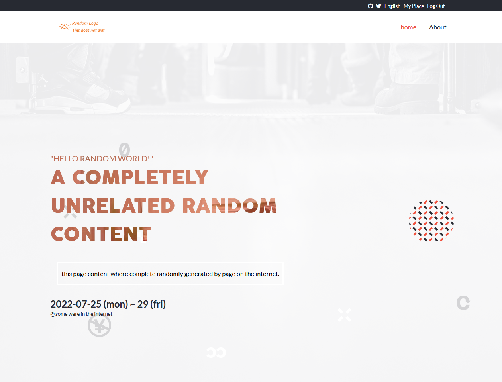

# Capstone Project - Conference Page

In this capstone project I are going to build is based on an online website for a conference. Microverse provide some design guidelines for me to create the website, but I must personalize the content, i.e., instead of a conference you can build a website for a concert or for a web development course. It's very important the I personalize my project so that I have something unique in my portfolio to share with potential employers during job searching.



 ## Learning objectives

 - Use semantic HTML tags.
 - Apply best practices in HTML code.
 - Use CSS selectors correctly.
 - Use CSS box model.
 - Use Flexbox to place elements in the page.
 - Demonstrate ability to create UIs adaptable to different screen sizes using media queries.
 - Use GitHub Pages to deploy web pages.
 - Apply JavaScript best practices and language style guides in code.
 - Use JavaScript to manipulate DOM elements.
 - Use JavaScript events.
 - Use objects to store and access data.
 - Communicate technical concepts to other technical people.

## Built With

- CSS, HTML, JavaScript
- SCSS preprocessor

## Live Demo

[Live Demo Link](https://carlosmuerto.github.io/capstone-project-conference-page/)

## Video Presentation

[](https://www.loom.com/share/1c3bd90055704b12836d424c040530ba "Presentation of Capstone Project:Conference Page")

## Getting Started

### To launch the project locally:

#### Step 1:
- Clone this repo locally using git and the following git command

```bash
git clone https://github.com/carlosmuerto/capstone-project-conference-page.git
```

#### Step 2:

- Run index.html file in your browser or run a life server
- Use developer tools in order to view Mobile version

## Authors

👤 Carlos Vivas

- GitHub: [@carlosmuerto](https://github.com/carlosmuerto)
- LinkedIn: [Carlos Vivas](https://www.linkedin.com/in/carlos-vivas-818ab831/)


## 🤝 Contributing

Contributions, issues and feature requests are welcome!

Feel free to check the [issues page](issues/).

## Show your support

Give a ⭐️ if you like this project!

## Acknowledgments

### Design Cindy Shin


- behance: [Cindy Shin](https://www.behance.net/adagio07)
- LinkedIn: [Cindy Shin](https://www.linkedin.com/in/adagio07/)
- dribbble: [Cindy Shin](https://dribbble.com/adagio07/collections)

## 📝 License

This project is [MIT](LICENSE.md) licensed.
